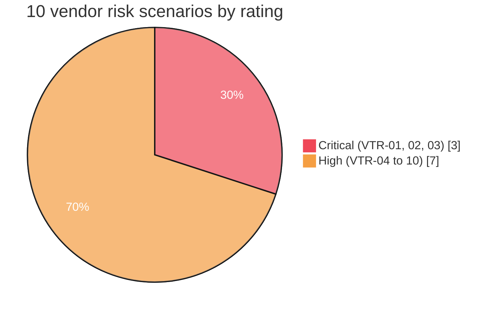
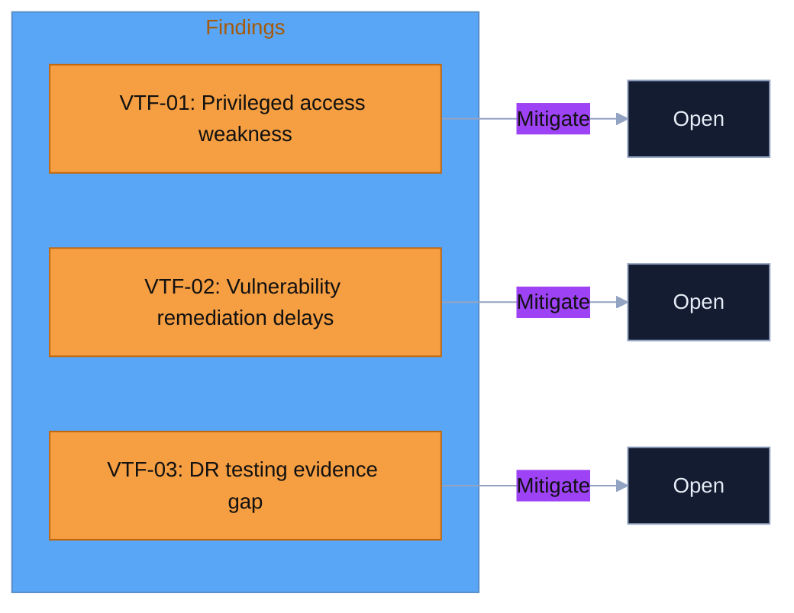

# NovaPay Enterprise Risk Assessment

Interactive third-party/vendor risk dashboard for NovaPay, a fictional payments company, built to demonstrate an end-to-end Third-Party Risk Management (TPRM) workflow: vendor criticality, inherent risk scoring, due-diligence evidence review, control testing, findings and remediation tracking, risk treatment, exception management, and ongoing vendor monitoring.

## Author

Taiwo Johnson (TJON) | GRC and Compliance Analyst | ISO 27001, PCI-DSS, GDPR, NIST CSF, SOC 2 | Third-Party Risk Management

## Executive Summary

NovaPay is a fictional payments company. This assessment evaluates PayLink Cloud Services Ltd., a critical vendor providing cloud-based payment API and transaction-processing infrastructure, ahead of onboarding.

The assessment scored 10 vendor risks across the third-party risk domain. Three risks are rated Critical and seven are rated High, none Medium or Low. Of the 18 requested due-diligence evidence items, 17 were received; the one gap (disaster recovery test evidence) is the single largest driver of the current risk position. Five representative controls were tested in detail: one is fully effective, three are partially effective, and one has an unresolved evidence gap. Three findings remain open, all High severity, all routed to mitigation. VTF-03 links to two risks (VTR-03 and VTR-10), so the dashboard's tracker shows it as two rows even though it is one finding. No risk acceptance has been recorded. EXC-001 is a proposed exception pending formal approval.

The dashboard exists to show the full evidence chain, not just a final rating: how a vendor moves from profile and criticality through inherent risk, evidence, control testing, findings, residual risk, treatment, and ongoing monitoring.

## Scope

| In Scope | Out of Scope |
| --- | --- |
| Third-party/vendor risk assessment of PayLink Cloud Services Ltd. | The other four planned domains: enterprise/information-security, compliance, operational, and technology risk |
| Inherent risk scoring across 10 factors (data sensitivity, system access, business criticality, etc.) | A full vendor portfolio; only one representative critical vendor is modeled |
| 18-item due-diligence evidence register and review | Independent verification of any real-world vendor's actual controls |
| Control design vs. operating effectiveness testing for 5 representative controls | Quantitative/statistical risk modeling |
| Findings, residual risk, treatment decisions, and ongoing monitoring KRIs | Live integration with a GRC platform; the dashboard is static |

## Assumptions

The following assumptions underpin the assessment and dashboard:

1. All vendor, risk, evidence, and finding data is simulated for portfolio purposes; PayLink Cloud Services Ltd. is fictional.
2. Where evidence was marked "received" (e.g. an ISO 27001 certificate), it is treated as evidence of a certification status, not proof that every relevant control is operating effectively, unless scope and validity are separately confirmed.
3. Where evidence was not supplied (the disaster recovery test report), the assessment does not assume the underlying control is absent or ineffective. It withholds a risk-reducing credit until the evidence exists. This is a deliberate conservative treatment of uncertainty, not a finding of failure.
4. Risk scores reflect a qualitative 5x5 likelihood/impact model, not a probabilistic or financial estimate.
5. The assessment reflects a single point in time. Vendor risk is treated as continuous in principle, but this dashboard does not auto-refresh.

## Framework and Assessment Boundary

ISO 27001, PCI DSS v4.0.1, NIST CSF 2.0, GDPR, and SOC 2 are used as illustrative reference points for evidence and control evaluation. This portfolio project is not a formal ISO 27001 certification assessment, PCI DSS assessment, SOC 2 examination, GDPR compliance audit, or independent assurance engagement. No real vendor evidence was independently validated.

The project demonstrates TPRM methodology rather than claiming compliance with any of these frameworks.

## Risk Rating Criteria

All risks are scored using a 5x5 likelihood and impact matrix, producing a score from 1 to 25.

### Likelihood scale

| Score | Rating | Definition |
| --- | --- | --- |
| 1 | Rare | May occur only in exceptional circumstances |
| 2 | Unlikely | Could occur at some point |
| 3 | Possible | Might occur under certain conditions |
| 4 | Likely | Expected to occur in most circumstances |
| 5 | Almost Certain | Expected to occur in the normal course of the relationship |

### Impact scale

| Score | Rating | Definition |
| --- | --- | --- |
| 1 | Insignificant | Minimal operational or regulatory effect |
| 2 | Minor | Limited disruption, contained internal impact |
| 3 | Moderate | Noticeable disruption to operations or compliance posture |
| 4 | Major | Significant disruption, customer or regulatory consequences |
| 5 | Severe | Critical disruption to payment operations or regulatory standing |

### Risk rating matrix

```mermaid
%%{init: {'theme':'base', 'themeVariables': {'primaryColor':'#4da3ff','primaryTextColor':'#0b1220','primaryBorderColor':'#1c6fd1','lineColor':'#4da3ff','fontSize':'14px'}}}%%
flowchart LR
    A[Vendor Profile] --> B[Business Criticality]
    B --> C[Inherent Risk]
    C --> D[Due-Diligence Evidence]
    D --> E[Control Assessment]
    E --> F[Control Effectiveness]
    F --> G[Residual Risk]
    G --> H[Risk Treatment]
    H --> I[Acceptance / Escalation]
    I --> J[Ongoing Monitoring]

    classDef crit fill:#ef4757,stroke:#b91c2c,color:#fff;
    class C crit
```

| Score range | Rating |
| --- | --- |
| 1 to 5 |  |
| 6 to 11 |  |
| 12 to 19 |  |
| 20 to 25 |  |

## How Critical Risks Were Scored

The three Critical-rated risks all scored 20 (Likelihood 4 x Impact 5). Each is explained below.

| Risk | Likelihood | Impact | Score | Rationale |
| --- | --- | --- | --- | --- |
| VTR-01: Unauthorized access to NovaPay data through vendor compromise | 4 | 5 | 20 | PayLink holds technical/API access to customer identifiers, transaction data, and payment credentials |
| VTR-02: Vendor API compromise disrupts payment processing | 4 | 5 | 20 | Direct API integration into NovaPay's payment platform makes a compromise immediately operationally consequential |
| VTR-03: Vendor outage disrupts payment services | 4 | 5 | 20 | High business dependency on PayLink, with no validated disaster recovery test evidence to offset the score |

## Risk Categories Covered

| Category | Risks |
| --- | --- |
| Access and privileged access | VTR-01, VTR-05 |
| Payment processing availability | VTR-02, VTR-03, VTR-10 |
| Vulnerability management | VTR-04 |
| Logging and monitoring | VTR-07 |
| Subcontractor / fourth-party exposure | VTR-08 |
| Data retention | VTR-09 |

## Dashboard Visuals

| Section (in `index.html`) | Description |
| --- | --- |
| KPI overview | Critical/High risk counts, evidence completeness, open findings, control effectiveness |
| Risk register table | All 10 VTR risk scenarios with likelihood, impact, score, and rating |
| Risk heatmap | 5x5 likelihood/impact plot of all 10 vendor risks |
| Due-diligence evidence register | 18-item evidence tracker (collapsible) with per-item status |
| Control assessment | Design vs. operating effectiveness for 5 tested controls |
| Findings and remediation tracker | Inherent vs. current residual risk for each open finding |
| Risk decision and acceptance | Treatment decisions, accountable owners, and proposed exception status |
| Ongoing vendor monitoring model | 7 KRIs with linked risks/findings, owners, thresholds, actions, escalation and reassessment triggers |

## Risk Register

The full risk register (`cloud/Risk Register`, `cloud/Vendor Risk Assessment`) lists each risk with an ID, scenario description, likelihood, impact, inherent score, and rating. The due-diligence evidence register (`cloud/Vendor Due-Diligence Evidence Register`) ties each of the 18 requested evidence items to the risk area it addresses and its review status.

## How to Use

1. View the live dashboard: [tjon-star.github.io/NovaPay-Enterprise-Risk-Assessment](https://tjon-star.github.io/NovaPay-Enterprise-Risk-Assessment/)
2. Or clone the repo and open `index.html` directly in a browser.
3. Read through `cloud/1.6 Subcontractor /` for the full worked walkthrough, in order, from building the evidence matrix through risk acceptance and exception management.

## Tech Stack

Tools: HTML5, CSS3 (custom properties, no framework), GitHub Pages, Mermaid (diagrams, rendered natively by GitHub)

## Step 14: Ongoing Third-Party Risk Monitoring Model

The monitoring model links each KRI to a threshold, action, owner, escalation path and reassessment trigger. A threshold breach is a signal for review, not an automatic change to the risk score. Risk ratings change only after evidence-based reassessment.

The seven monitored KRIs cover critical vulnerabilities, material security incidents, disaster recovery testing, privileged-access reviews, SLA availability, overdue high-severity findings, and security certification status. EXC-001 is monitored as an open proposed exception until its DR evidence gap is validated or the exception is formally approved, renewed or closed.

## Lessons Learned

1. **Certification is not control effectiveness.** An ISO 27001 certificate proves a certification status. It does not by itself prove that every control relevant to NovaPay's specific service is operating effectively; scope and validity still need to be checked.
2. **Design evidence and operating evidence are different things.** A policy document proves a control is designed. Proving it works requires separate operating evidence, such as actual access-review records.
3. **Absence of evidence should be treated conservatively, not assumed favorably.** When PayLink could not provide a DR test report, the residual risk was kept at its inherent level rather than reduced. The gap is not proof the vendor lacks recovery capability, but the score should not assume capability that hasn't been demonstrated either.
4. **Finding severity and risk rating are not interchangeable.** VTF-03 is a High-severity finding, while the underlying VTR-03 risk it affects is rated Critical. They are tracked separately on purpose.
5. **One finding can affect more than one risk.** VTF-03 links to both VTR-03 and VTR-10, and each must be reassessed independently once remediation evidence is received.

## Limitations

- **Point-in-time assessment.** The dashboard reflects the vendor's documented control environment at the time of assessment; it does not auto-refresh.
- **Single vendor, single domain.** Only the third-party/vendor risk module is built, using one representative critical vendor rather than a full portfolio.
- **Simulated data.** All vendor, risk, evidence, and finding data is fictional and was not independently tested against a real organization.
- **No live GRC integration.** The dashboard is a static file with hardcoded data; it does not pull from a GRC platform.
- **Qualitative scoring only.** Risk scores use an ordinal 5x5 scale, not statistical or financial modeling.

## How This Project Would Change in Production

| Portfolio Version | Production Version |
| --- | --- |
| Single vendor (PayLink) worked example | Full vendor portfolio scored and monitored |
| Static HTML dashboard with hardcoded data | Dashboard connected live to a GRC/IRM platform (e.g. ServiceNow GRC, Vanta, OneTrust) |
| Evidence review documented in markdown | Evidence intake and workflow tracked in a GRC/IRM tool with a full audit trail |
| One risk domain (third-party/vendor) | All five domains scored under one enterprise risk framework |
| Qualitative 5x5 scoring only | Qualitative scoring supplemented with quantitative modeling where data supports it |
| Findings tracked in static tables | Findings tracked with automated due dates, SLA alerting, and escalation workflows |

## Roadmap

- Build out the remaining four modules: enterprise/information-security, compliance, operational, and technology risk
- Add a second worked vendor example to demonstrate portfolio-level aggregation and trend reporting
- Move dashboard data into a structured source (JSON/CSV) instead of hardcoded HTML, so updates don't require editing markup
- Add quantitative modeling for the highest-criticality risks

## Disclaimer

This is a portfolio project. It does not represent a live NovaPay production environment or a formal compliance assessment. See [SECURITY.md](SECURITY.md) for the full scope statement and responsible disclosure process.

## License

BSD 2-Clause License. See [LICENSE](LICENSE).
